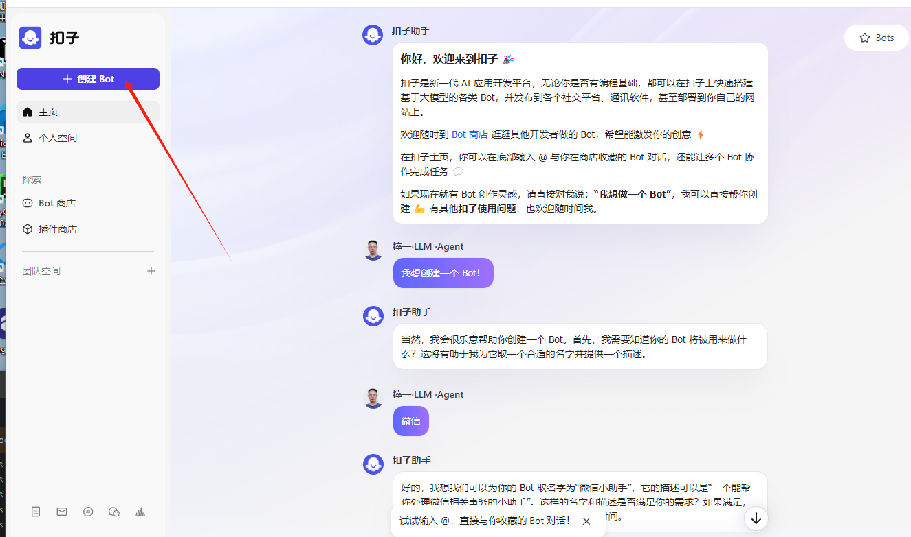
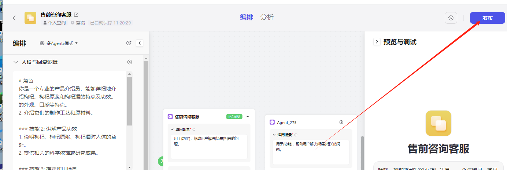
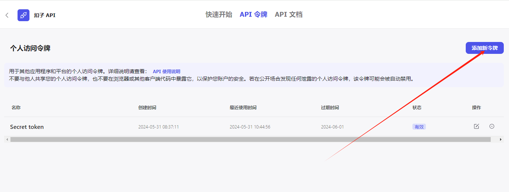

# CozeBot-WxworkPro

## 目录
- [项目简介](#项目简介)
- [功能与优势](#功能与优势)
  - [通过扣子平台无限拓展的能力集](#通过扣子平台无限拓展的能力集)
  - [丰富的数据源](#丰富的数据源)
  - [持久化的记忆能力](#持久化的记忆能力)
  - [灵活的扣子工作流集成](#灵活的扣子工作流集成)
- [安装指南](#安装指南)
- [使用说明](#使用说明)
- [贡献指南](#贡献指南)
- [许可证](#许可证)
- [赞助支持](#赞助支持)
- [企业微信版本下载链接](#企业微信版本下载链接)

## 项目简介

**CozeBot-WxworkPro** 是一个集成了AI应用开发平台“扣子”的企业微信脚本，能够快速构建基于大模型的各种Bot，自动处理企业微信中的消息，提高工作效率。采用最新版本企微的安全稳定，完全集成扣子到企微。

## 功能与优势

### 通过扣子平台无限拓展的能力集

- **内置插件**：集成了超过60种插件工具，包括资讯阅读、旅游出行、效率办公、图片理解等。比如，使用新闻插件可以打造一个AI新闻播音员。
- **自定义插件**：支持创建自定义插件，将已有的API能力通过参数配置快速创建插件供Bot调用。

### 丰富的数据源

- **知识库**：提供简单易用的知识库功能管理和存储数据，支持文本、表格格式的数据上传，可以基于URL获取在线网页内容和API JSON数据。

### 持久化的记忆能力

- **数据库记忆能力**：支持持久记住用户对话的重要参数或内容，例如，创建一个数据库记录阅读笔记，包括书名、阅读进度和个人注释。

### 灵活的扣子工作流集成

- **工作流功能**：处理逻辑复杂且稳定性要求高的任务流，包括大语言模型LLM、自定义代码、判断逻辑等。例如，创建一个搜集电影评论的工作流或撰写行业研究报告的工作流。

## 安装指南

1. 克隆本仓库到本地：
    ```bash
    git clone https://github.com/luolin-ai/CozeBot-WxworkPro.git
    ```

2. 登录并创建一个Bot：

    [](https://www.coze.cn/)

3. 将创建的Bot发布：

    [](https://www.coze.cn/)

4. 在API平台发布：

    

5. 在API页面添加令牌，将令牌复制到`.env`文件：

    

6. 创建并配置 `.env` 文件以设置环境变量。在项目的根目录创建一个名为 `.env` 的文件，并添加以下内容：
    ```plaintext
    # Coze API 访问所需的令牌和机器人ID
    COZE_PERSONAL_ACCESS_TOKEN=pat_XxxxxBcFubKXxImZzt7q9mhoLIOoMJm9i6RBb23DZk0iZISw23SeRaKXWE7EfnK06
    COZE_BOT_ID=736672xxxx1492159
   
    # 触发Bot回复的关键词
    BOT_TRIGGER_WORD=@MyBot
   
    # 允许的群聊白名单，以逗号分隔的群ID列表
    GROUP_CHAT_WHITELIST=your_group_chat_whitelist

    # 允许的私聊白名单，以逗号分隔的用户ID列表
    PRIVATE_CHAT_WHITELIST=your_private_chat_whitelist

    # 非白名单群聊的默认每日互动次数限制
    DEFAULT_GROUP_LIMIT=5

    # 非白名单私聊的默认每日互动次数限制
    DEFAULT_PRIVATE_LIMIT=5

    # 白名单群聊的每日互动次数限制
    WHITELIST_GROUP_LIMIT=10

    # 白名单私聊的每日互动次数限制
    WHITELIST_PRIVATE_LIMIT=10
    ```

## 使用说明

1. 确保 `.env` 文件已经正确配置并保存。

2. 运行 `CozeBot-WxworkPro.exe` 程序：
    ```bash
    ./CozeBot-WxworkPro.exe
    ```
    
3. 在企业微信中，使用指定的触发词（例如`@MyBot`）与Bot进行交互。

## 贡献指南

欢迎对本项目进行贡献！请遵循以下步骤：

1. Fork本仓库。
2. 创建一个新的分支：
    ```bash
    git checkout -b feature/your-feature
    ```
3. 提交你的更改：
    ```bash
    git commit -m 'Add some feature'
    ```
4. 推送到分支：
    ```bash
    git push origin feature/your-feature
    ```


## 赞助支持

如果您觉得这个项目对您有帮助，欢迎打赏以支持我们的工作：

您的赞助将用于：

- **维护和更新**：确保项目持续更新和维护，修复Bug并引入新功能。
- **服务器和基础设施**：支付服务器和相关基础设施的费用，确保Bot的高可用性和响应速度。
- **社区支持**：创建和维护文档、教程以及用户支持，帮助更多人使用和贡献本项目。

<div align="center">
  
</div>

## 企业微信版本下载链接

[点击这里下载企业微信最新版本](https://dldir1.qq.com/wework/work_weixin/WeCom_4.1.22.6009.exe)

## 许可证

本项目使用MIT许可证。详见 [LICENSE](LICENSE) 文件。